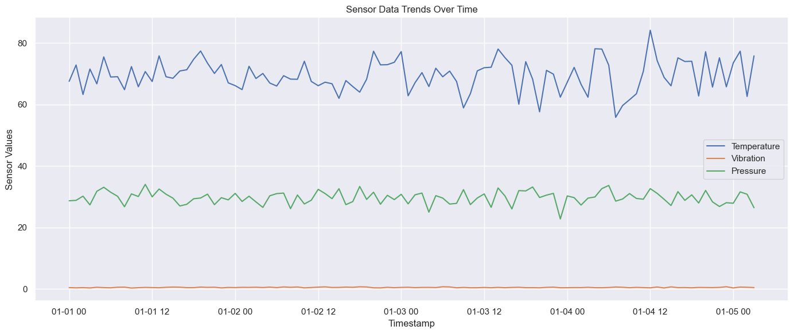
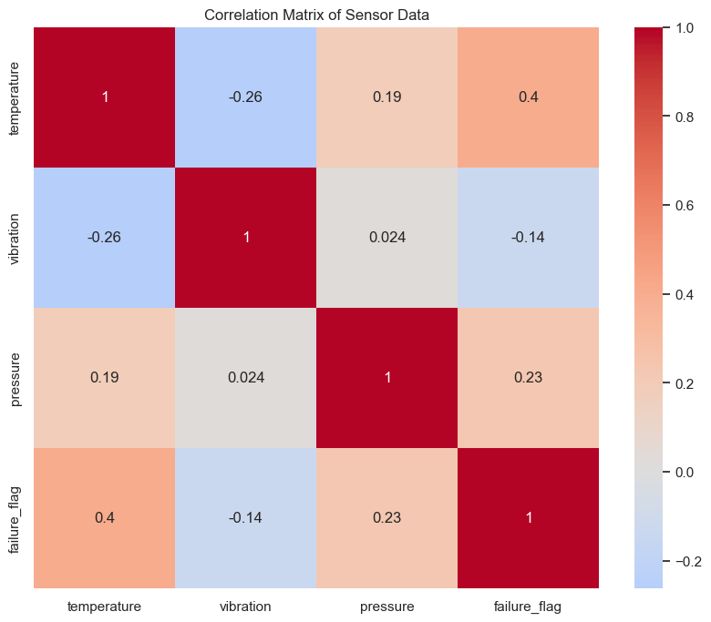
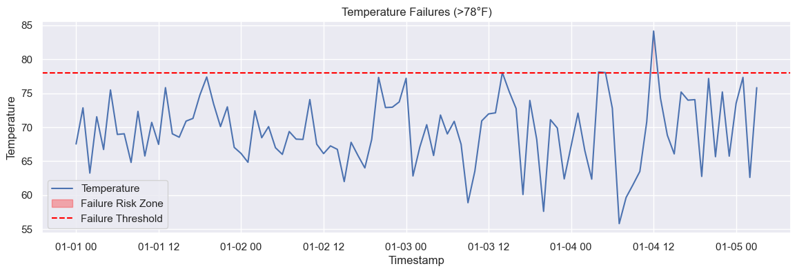
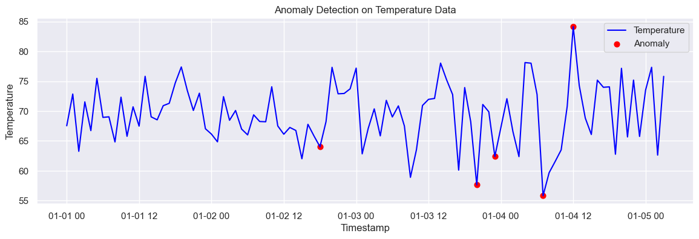

# 🔧 Predictive Maintenance and Smart Automation

This project simulates real-world sensor data and uses machine learning to **detect anomalies and predict failures** before they occur.

🧠 It's based on my technical blog:  
📖 [How AI Detects Failures Before They Happen – A Predictive Maintenance Tutorial](https://medium.com/@myakalarajkumar1998/how-ai-detects-failures-before-they-happen-a-predictive-maintenance-tutorial-657b4ccaaaf0)

---

## 🚀 Objective

To demonstrate how AI and ML can be applied to detect equipment failure in advance using simulated IoT sensor data — a core concept in **smart automation and predictive maintenance**.

---

## 🧠 Technologies Used

- Python 3.x  
- pandas, numpy, matplotlib, seaborn  
- scikit-learn (Isolation Forest)  
- Jupyter Notebook  
- Simulated dataset (temperature, vibration, pressure)

---

## 📁 Project Structure
predictive-maintenance-and-smart-automation/
- data/
    - sensor_data.csv # Simulated sensor input 
- notebooks/ 
    -  predictive_model.ipynb # Main notebook (EDA + ML) 
    -  plots
- src/ 
    - main.py 
- utils/ 
    - data_generator.py  #Sensor data generator 
- requirements.txt 
- README.md

---

---

## 📊 Output Snapshots

### Sensor Trends


### Correlation Matrix


### Failure Threshold Visualization


### Anomaly Detection (Isolation Forest)



---

## 📝 Blog Summary

In the blog, I covered:

- Why predictive maintenance matters
- How to simulate and analyze sensor data
- Using Isolation Forest for anomaly detection
- Visualizing failure zones
- Future roadmap: streaming, time series forecasting, and GCP MLOps

---

## 📌 How to Run

```bash
git clone https://github.com/rajkumar160798/predictive-maintenance-and-smart-automation.git
cd predictive-maintenance-and-smart-automation
pip install -r requirements.txt
jupyter notebook
```

---

## 👨‍💻 Author
**Raj Kumar Myakala**  
AI | Data | Automation | GCP | Python  
[LinkedIn ](https://www.linkedin.com/in/raj-kumar-myakala-927860264/)  
[GitHub ](https://github.com/rajkumar160798)

---

> ⭐ If you like this project, consider starring the repo and following my GitHub for more AI/ML innovations!
